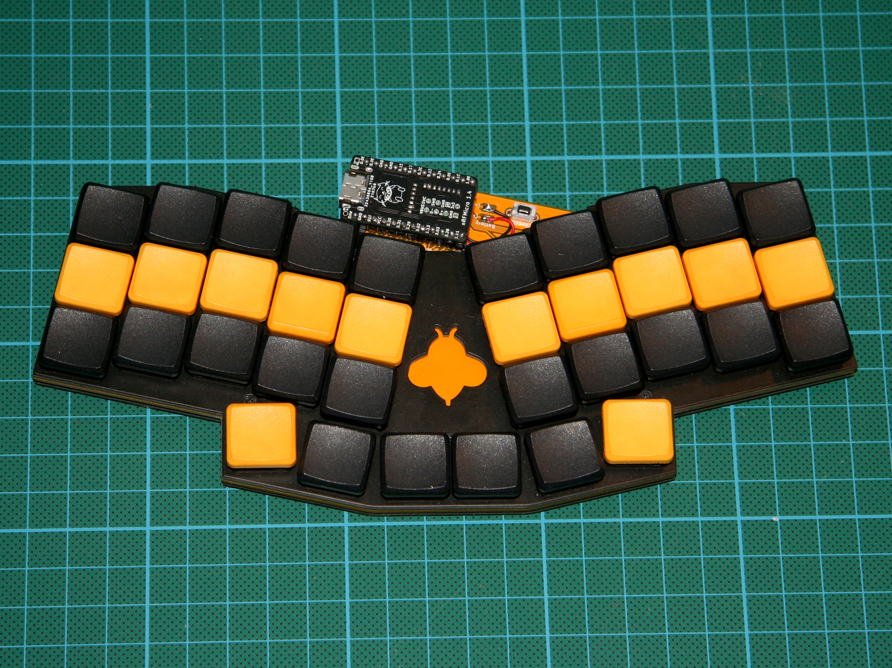
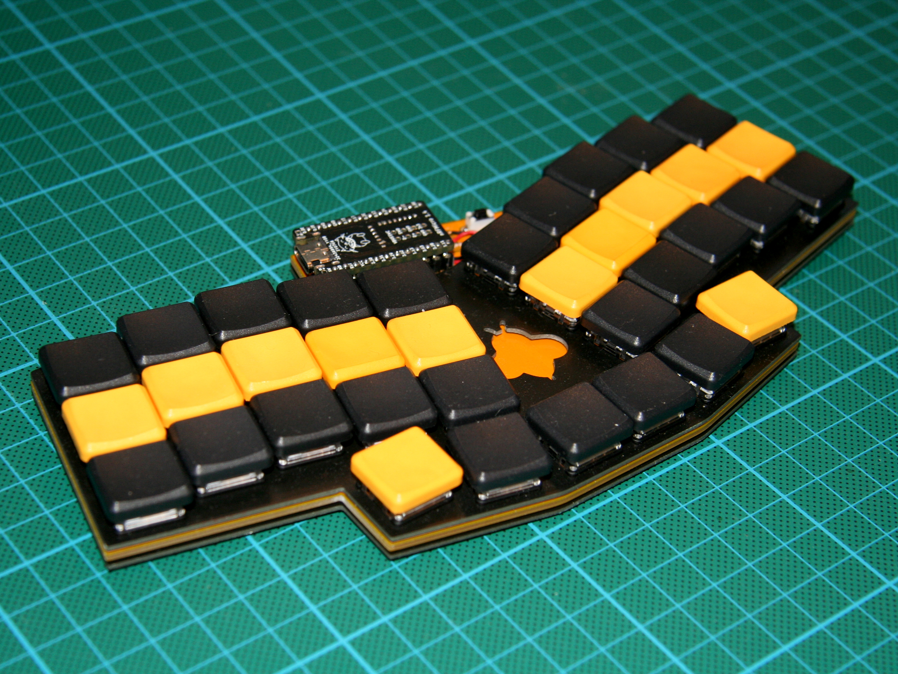
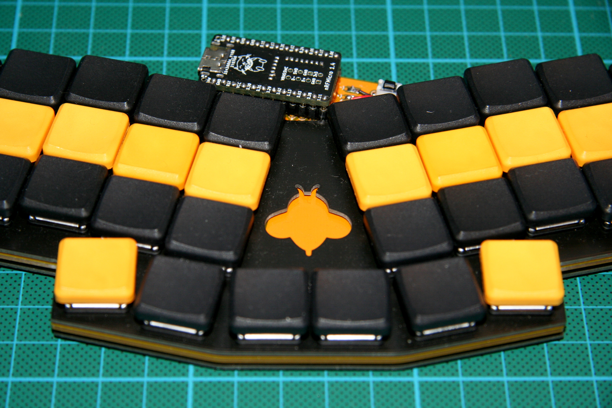

# Humla

The Humla is a 36-key low profile keyboard based on [the Reviung by gtips](https://github.com/gtips/reviung/) and [the Rev-lp by cyril279](https://github.com/cyril279/keyboards/tree/main/revlp). It is for choc switches (with 18x17mm spacing) and has basic support for bluetooth pro micro alternatives such as the [nRFMicro](https://github.com/joric/nrfmicro). Humla means blumblebee in Swedish.

