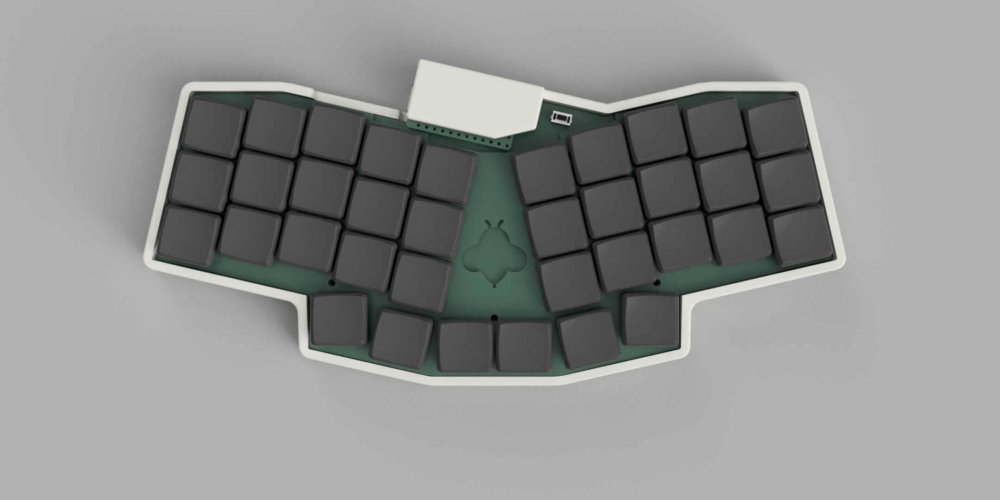
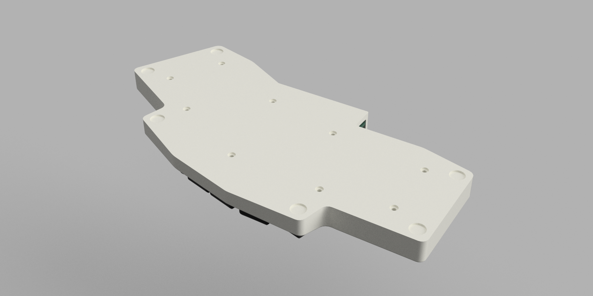
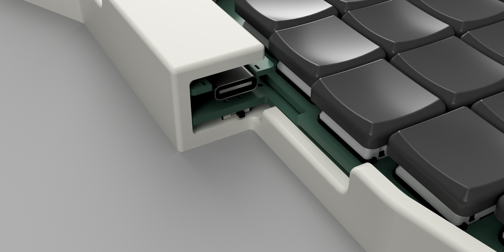
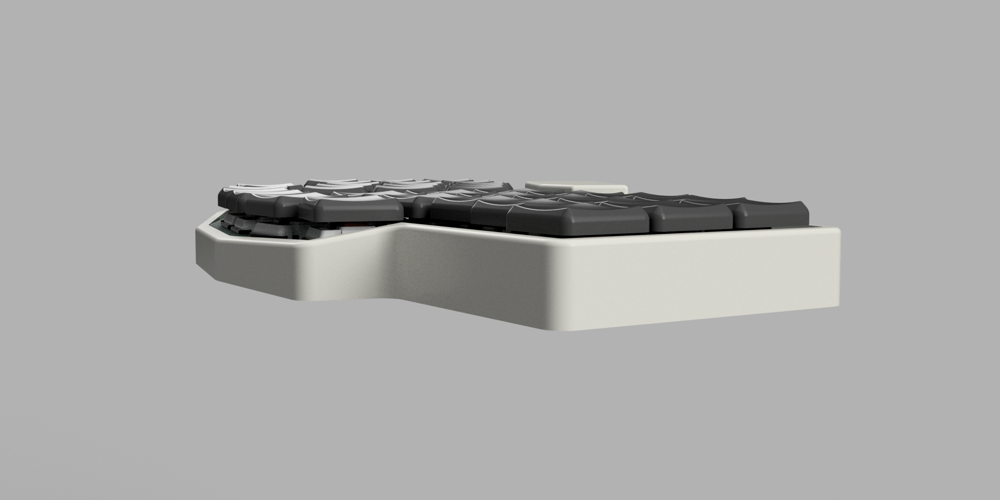

# 3D printed case

Case is supposed to replace base (bottom) plate using the same standoff and screws.

Source file for Fusion 360 is available so it's easy to update parameters for desired thickness, height and hole dimensions.

Default version has 3mm thickness and is optimized for 8x2mm bumpons and M2 screws with 4mm flat heads.

Designed by [@zzeneg](https://github.com/zzeneg).

## Renders

